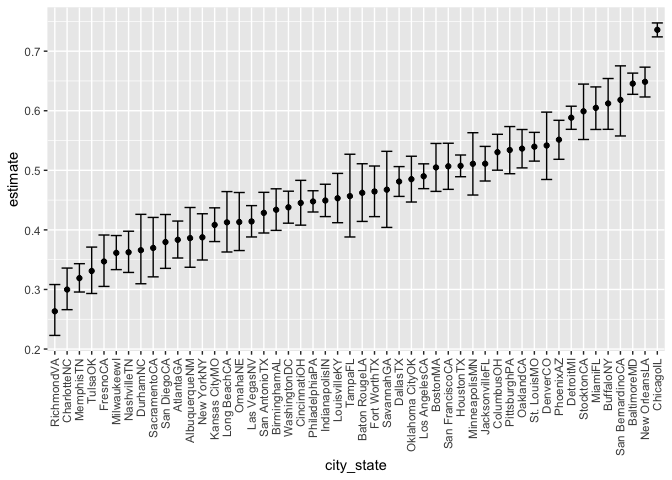

hw5
================
Matthew Spotnitz
11/14/2021

``` r
library(tidyverse)
```

    ## ── Attaching packages ─────────────────────────────────────── tidyverse 1.3.1 ──

    ## ✓ ggplot2 3.3.5     ✓ purrr   0.3.4
    ## ✓ tibble  3.1.5     ✓ dplyr   1.0.7
    ## ✓ tidyr   1.1.3     ✓ stringr 1.4.0
    ## ✓ readr   2.0.1     ✓ forcats 0.5.1

    ## ── Conflicts ────────────────────────────────────────── tidyverse_conflicts() ──
    ## x dplyr::filter() masks stats::filter()
    ## x dplyr::lag()    masks stats::lag()

``` r
library(ggplot2)
library(rvest)
```

    ## 
    ## Attaching package: 'rvest'

    ## The following object is masked from 'package:readr':
    ## 
    ##     guess_encoding

``` r
library(stringr)
```

\#\#Problem 1

``` r
homicide_df = read.csv("homicide-data.csv")
head(homicide_df)
```

    ##          uid reported_date victim_last victim_first victim_race victim_age
    ## 1 Alb-000001      20100504      GARCIA         JUAN    Hispanic         78
    ## 2 Alb-000002      20100216     MONTOYA      CAMERON    Hispanic         17
    ## 3 Alb-000003      20100601 SATTERFIELD      VIVIANA       White         15
    ## 4 Alb-000004      20100101    MENDIOLA       CARLOS    Hispanic         32
    ## 5 Alb-000005      20100102        MULA       VIVIAN       White         72
    ## 6 Alb-000006      20100126        BOOK    GERALDINE       White         91
    ##   victim_sex        city state      lat       lon           disposition
    ## 1       Male Albuquerque    NM 35.09579 -106.5386 Closed without arrest
    ## 2       Male Albuquerque    NM 35.05681 -106.7153      Closed by arrest
    ## 3     Female Albuquerque    NM 35.08609 -106.6956 Closed without arrest
    ## 4       Male Albuquerque    NM 35.07849 -106.5561      Closed by arrest
    ## 5     Female Albuquerque    NM 35.13036 -106.5810 Closed without arrest
    ## 6     Female Albuquerque    NM 35.15111 -106.5378        Open/No arrest

``` r
tail(homicide_df)
```

    ##              uid reported_date victim_last victim_first victim_race victim_age
    ## 52174 Was-001379      20160715      HARRIS       SHAROD       Black         20
    ## 52175 Was-001380      20160908    WILLIAMS         EVAN       Black         29
    ## 52176 Was-001381      20160913       SMITH         DEON       Black         19
    ## 52177 Was-001382      20161114  WASHINGTON       WILLIE       Black         23
    ## 52178 Was-001383      20161130      BARNES       MARCUS       Black         24
    ## 52179 Was-001384      20160901     JACKSON        KEVIN       Black         17
    ##       victim_sex       city state      lat       lon      disposition
    ## 52174       Male Washington    DC 38.82727 -77.00157   Open/No arrest
    ## 52175       Male Washington    DC 38.82870 -77.00207 Closed by arrest
    ## 52176       Male Washington    DC 38.82285 -77.00173   Open/No arrest
    ## 52177       Male Washington    DC 38.82802 -77.00251   Open/No arrest
    ## 52178       Male Washington    DC 38.82048 -77.00864   Open/No arrest
    ## 52179       Male Washington    DC 38.86669 -76.98241 Closed by arrest

``` r
str(homicide_df)
```

    ## 'data.frame':    52179 obs. of  12 variables:
    ##  $ uid          : chr  "Alb-000001" "Alb-000002" "Alb-000003" "Alb-000004" ...
    ##  $ reported_date: int  20100504 20100216 20100601 20100101 20100102 20100126 20100127 20100127 20100130 20100210 ...
    ##  $ victim_last  : chr  "GARCIA" "MONTOYA" "SATTERFIELD" "MENDIOLA" ...
    ##  $ victim_first : chr  "JUAN" "CAMERON" "VIVIANA" "CARLOS" ...
    ##  $ victim_race  : chr  "Hispanic" "Hispanic" "White" "Hispanic" ...
    ##  $ victim_age   : chr  "78" "17" "15" "32" ...
    ##  $ victim_sex   : chr  "Male" "Male" "Female" "Male" ...
    ##  $ city         : chr  "Albuquerque" "Albuquerque" "Albuquerque" "Albuquerque" ...
    ##  $ state        : chr  "NM" "NM" "NM" "NM" ...
    ##  $ lat          : num  35.1 35.1 35.1 35.1 35.1 ...
    ##  $ lon          : num  -107 -107 -107 -107 -107 ...
    ##  $ disposition  : chr  "Closed without arrest" "Closed by arrest" "Closed without arrest" "Closed by arrest" ...

``` r
view(homicide_df)
```

This data set consists of 52179 observations and 12 variables. Of those
variables, all are characters except for “lat” and “lon”, which are
integers.

``` r
homicide_df = janitor::clean_names(homicide_df)
homicide_df = homicide_df %>% mutate (
  city_state = str_c(city, state),
  resolution = case_when(
    disposition == "Closed without arrest" ~ "unsolved",
    disposition == "Open/No arrest" ~ "unsolved",
    disposition == "Closed by arrest" ~ "solved" 
  )) %>% 
  relocate(city_state) %>% 
  filter(city_state != "TulsaAL")
```

Now I will focus on Baltimore, MD

``` r
baltimore_df = homicide_df %>% filter(city_state == "BaltimoreMD")

baltimore_summary = baltimore_df %>% summarize(
  unsolved = sum(resolution == "unsolved"), n = n()
) 

baltimore_test = prop.test(
  x = baltimore_summary %>% pull(unsolved),
  n = baltimore_summary %>% pull(n)
)

baltimore_test %>% broom::tidy()
```

    ## # A tibble: 1 × 8
    ##   estimate statistic  p.value parameter conf.low conf.high method    alternative
    ##      <dbl>     <dbl>    <dbl>     <int>    <dbl>     <dbl> <chr>     <chr>      
    ## 1    0.646      239. 6.46e-54         1    0.628     0.663 1-sample… two.sided

Now I will iterate this function.

``` r
prop_test_function = function(city_df) {
  city_summary = 
    city_df %>% 
    summarize(
      unsolved = sum(resolution == "unsolved"), n = n()
) 

city_test = prop.test(
  x = city_summary %>% pull(unsolved),
  n = city_summary %>% pull(n))
  
  return(city_test)

 
}

prop_test_function(baltimore_df)
```

    ## 
    ##  1-sample proportions test with continuity correction
    ## 
    ## data:  city_summary %>% pull(unsolved) out of city_summary %>% pull(n), null probability 0.5
    ## X-squared = 239.01, df = 1, p-value < 2.2e-16
    ## alternative hypothesis: true p is not equal to 0.5
    ## 95 percent confidence interval:
    ##  0.6275625 0.6631599
    ## sample estimates:
    ##         p 
    ## 0.6455607

``` r
homicide_df %>%
  filter(city_state == "AlbuquerqueNM") %>% 
  prop_test_function()
```

    ## 
    ##  1-sample proportions test with continuity correction
    ## 
    ## data:  city_summary %>% pull(unsolved) out of city_summary %>% pull(n), null probability 0.5
    ## X-squared = 19.114, df = 1, p-value = 1.232e-05
    ## alternative hypothesis: true p is not equal to 0.5
    ## 95 percent confidence interval:
    ##  0.3372604 0.4375766
    ## sample estimates:
    ##         p 
    ## 0.3862434

Now, I will iterate across all cities.

``` r
results_df =
  homicide_df %>% 
  nest(data = uid:resolution) %>% 
  mutate(
    test_results = map(data, prop_test_function),
    tidy_results = map(test_results, broom::tidy)
  ) %>% 
  select(city_state, tidy_results) %>% 
  unnest  (tidy_results) %>% 
  select(city_state, estimate, starts_with("conf"))
```

Now I will make a plot showing estimates and confidence intervals

``` r
results_df %>% 
  mutate(city_state = fct_reorder(city_state, estimate)) %>% 
  ggplot(aes(x = city_state, y = estimate)) +
  geom_point() +
  geom_errorbar(aes(ymin=conf.low, ymax = conf.high)) +
  theme(axis.text.x = element_text(angle = 90, vjust= 0.5, hjust = 1))
```

<!-- --> \#\#Problem 2

``` r
regexp = "[[:digit:]]+"
df_files = tibble(
  files = list.files("./data/zip_data/", pattern="*.csv", full.names=TRUE),
)
head(df_files)
```

    ## # A tibble: 6 × 1
    ##   files                      
    ##   <chr>                      
    ## 1 ./data/zip_data//con_01.csv
    ## 2 ./data/zip_data//con_02.csv
    ## 3 ./data/zip_data//con_03.csv
    ## 4 ./data/zip_data//con_04.csv
    ## 5 ./data/zip_data//con_05.csv
    ## 6 ./data/zip_data//con_06.csv

``` r
for (i in df_files) {
  read_files = purrr::map(i, read.csv)
  df_files = df_files %>% mutate(tidy_results = purrr::map(read_files, broom::tidy)) %>% unnest(tidy_results) #tidy results are stored
 
}
```

    ## Warning: Data frame tidiers are deprecated and will be removed in an upcoming
    ## release of broom.

    ## Warning: `data_frame()` was deprecated in tibble 1.1.0.
    ## Please use `tibble()` instead.
    ## This warning is displayed once every 8 hours.
    ## Call `lifecycle::last_lifecycle_warnings()` to see where this warning was generated.

    ## Warning: Data frame tidiers are deprecated and will be removed in an upcoming
    ## release of broom.

    ## Warning: Data frame tidiers are deprecated and will be removed in an upcoming
    ## release of broom.

    ## Warning: Data frame tidiers are deprecated and will be removed in an upcoming
    ## release of broom.

    ## Warning: Data frame tidiers are deprecated and will be removed in an upcoming
    ## release of broom.

    ## Warning: Data frame tidiers are deprecated and will be removed in an upcoming
    ## release of broom.

    ## Warning: Data frame tidiers are deprecated and will be removed in an upcoming
    ## release of broom.

    ## Warning: Data frame tidiers are deprecated and will be removed in an upcoming
    ## release of broom.

    ## Warning: Data frame tidiers are deprecated and will be removed in an upcoming
    ## release of broom.

    ## Warning: Data frame tidiers are deprecated and will be removed in an upcoming
    ## release of broom.

    ## Warning: Data frame tidiers are deprecated and will be removed in an upcoming
    ## release of broom.

    ## Warning: Data frame tidiers are deprecated and will be removed in an upcoming
    ## release of broom.

    ## Warning: Data frame tidiers are deprecated and will be removed in an upcoming
    ## release of broom.

    ## Warning: Data frame tidiers are deprecated and will be removed in an upcoming
    ## release of broom.

    ## Warning: Data frame tidiers are deprecated and will be removed in an upcoming
    ## release of broom.

    ## Warning: Data frame tidiers are deprecated and will be removed in an upcoming
    ## release of broom.

    ## Warning: Data frame tidiers are deprecated and will be removed in an upcoming
    ## release of broom.

    ## Warning: Data frame tidiers are deprecated and will be removed in an upcoming
    ## release of broom.

    ## Warning: Data frame tidiers are deprecated and will be removed in an upcoming
    ## release of broom.

    ## Warning: Data frame tidiers are deprecated and will be removed in an upcoming
    ## release of broom.

``` r
for (files in df_files){
df_files = df_files %>% mutate (arm = str_detect(files, "con")) %>% mutate (arm = factor(arm, labels = c('experimental', 'control') )) %>% mutate (subject_id = (str_extract(files, regexp))) #extracting control and experimental groups from the names
#df_files = df_files %>% mutate (subject_id = (str_extract(i, regexp)))
# df_files = df_files %>% mutate (arm = str_detect(i, "con")) %>% mutate(arm = as.integer(arm)) %>% mutate (arm = factor(arm, labels = c('experimental', 'control') )) #extracting control and experimental groups from the names
#df_files = df_files %>% mutate (subject_id = (str_extract(i, regexp))) # extracting subject ids
}
view(df_files)
```

\#\#Problem 3

``` r
set.seed(10)

iris_with_missing = iris %>% 
  map_df(~replace(.x, sample(1:150, 20), NA)) %>%
  mutate(Species = as.character(Species))

fill_in_missing = function(vector){
  if (is.numeric){
    
    .....
    
  }
  if (is.character){
    
    ...
  }
}
```
